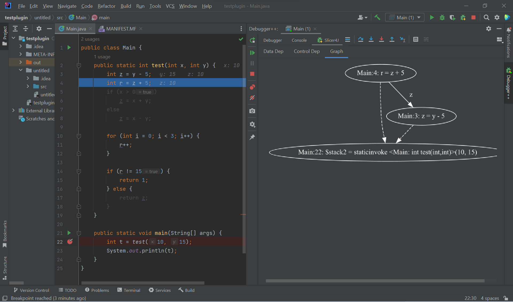

<h1 align="center">Debugger++: Slice-based debugging for IntelliJ</h1>

This plugin integrates dynamic slicing into the existing IntelliJ IDE Debugger. The slicing implementation has been developed by the ReSeSS Research Lab, through the tool [Slicer4J](https://github.com/resess/Slicer4J).

## 1. Prerequisites
- Ensure that you have [Graphviz](https://graphviz.org/) installed.
- We recommend gaining familiarity with slicing-based debugging and dynamic analysis. 

## 2. Setup
- Clone this repository. 
- Open it as a new project in IntelliJ IDE 
- Ensure the 'Run Plugin' run configuration is selected and run it by pressing on the green run button in the toolbar.
- IntelliJ will prompt you to create a new project, or will open up an existing project in a new window, which is an IDE instance with the plugin running live. 

## 3. Using Debugger++
- Right-click on a buggy line in the source code editor and select the "Start slicing from this line" option in the pop-menu to select it as the slicing criterion. 

- The IDE begins executing the dynamic slicing as shown below, with the progress bar.

- Once the program slice is computed, the IDE starts a new debugging session and grays out program statements that are not in the slice in the source code viewer. A new breakpoint will be added to the first slice line if it does not already exist. At this point, one can no longer add breakpoints to non-slice lines ie. grayed out lines. A new Debugger++ instance opens to control the new debugging session.

- The user can press any of the Debugger++ Actions including Step Over, Step Into, Run to Cursor etc. to execute the program slice. These actions will behave similarly to the traditional debugger, with the difference that it only navigate through the program slice. 

- The Debugger++ instance has a new tab which includes 3 sub-tabs. The data dependencies, control dependencies, and a dependencies graph visualization of the current statement are shown within these sub-tabs, respectively. They update dynamically to reflect the relevant information for the current line being executed in the debugging session.
  

## 4. Architecture 

## 5. Authors and acknowledgment
This project was developed by Arya Subramanyam, Juntong Luo, Jane Shi and Robin Lai for the ReSeSS Research Lab. 

Khaled Ahmed, Mieszko Lis, and Julia Rubin. Slicer4J: A Dynamic Slicer for Java. The ACM Joint European Software Engineering Conference and Symposium on the Foundations of Software Engineering (ESEC/FSE), 2021. <bibtex>

## 6. Ideas for Future Development 
- Change the dependencies graph to be clickable to allow a user to jump back to the debugging session state at which the graph node was added
- Change the dependencies graph to have toggle-able dropdowns for each level, and optionally remove the control and data dependencies tabs which only showcase direct and not transitive dependencies (1st level of the graph)

